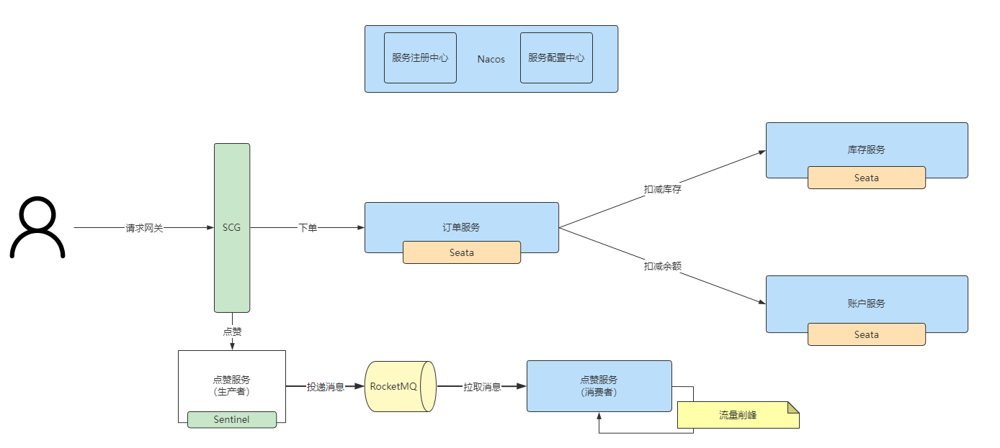
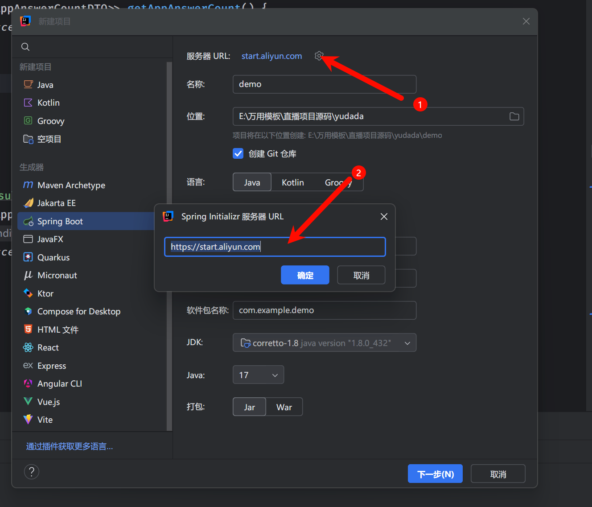
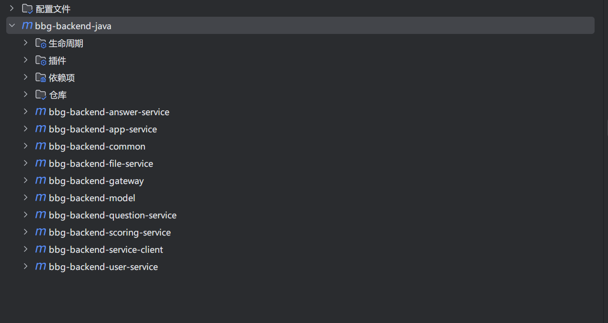
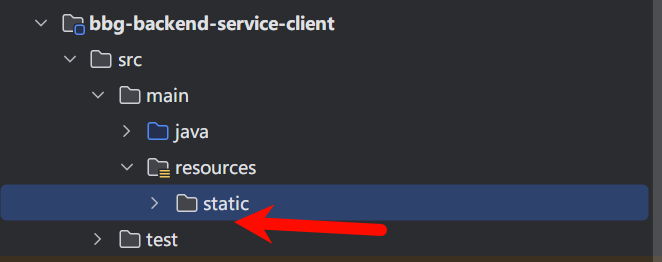

+++
title = '初始化一个Spring Cloud'
date = 2024-10-26T12:51:36+08:00
draft = false
+++

# 1. 初始化前情提要

此处以：2021.0.5.0 版本为例，Spring Boot 要求：2.6.13 版本

其余对应组件版本如下

|            | Sentinel Version | Nacos Version | RocketMQ Version | Dubbo Version | Seata Version |
| ---------- | ---------------- | ------------- | ---------------- | ------------- | ------------- |
| 2021.0.6.0 | 1.8.6            | 2.2.0         | 4.9.4            | ~             | 1.6.1         |

# 2. 项目学习

参考：[最佳实践示例-阿里云Spring Cloud Alibaba官网](https://sca.aliyun.com/docs/2021/best-practice/integrated-example/?spm=5176.29160081.0.0.74805c72MQ9hZo)

## 2.1 微服务的请求流程



Nacos：集中存管项目中所有服务的信息，便于服务之间找到彼此；同时，还支持集中存储整个项目中的配置。

## 2.2 微服务划分（以我的个人项目为例）

0. 依赖服务
   * 注册中心：Nacos
   * 微服务网关：Gateway，聚合所有接口，统一接受处理前端的请求
1. 公共能力(bbg-backend-common)：异常处理、请求响应封装、AI能力
2. 模型模块(bbg-backend-model)：实体类
3. 公共接口模块(bbg-backend-service-client)：只存放接口，不存放实现
4. 业务模块（详情请参考鱼答答项目）
   1. 用户模块(bbg-backend-user-service port:8102)
   2. 应用模块(bbg-backend-app-service port:8103)
   3. 题目模块(bbg-backend-question-service :8104)
   4. 评分模块(bbg-backend-scoring-service :8105)
   5. 用户回答模块(bbg-backend-answer-service :8106)
   6. 文件模块(bbg-backend-file-service :8107)

## 2.3 路由划分（以我的个人项目为例，inner代表内部调用，网关层面做限制）

* 用户模块(bbg-backend-user-service port:8102): /api/user /api/user/inner
* 应用模块(含统计，bbg-backend-app-service port:8103): /api/app /api/app/inner
* 题目模块(bbg-backend-question-service :8104): /api/question /api/question/inner
* 评分模块(bbg-backend-scoring-service :8105): /api/scoringResult /api/scoringResult/inner
* 用户答案模块(bbg-backend-answer-service :8106): /api/userAnswer /api/userAnswer/inner
* 文件模块(bbg-backend-file-service :8107): /api/scoring /api/scoring/inner

## 2.4 Nacos 服务中心注册

官网：[Nacos 配置中心简介, Nacos 是什么 | Nacos 官网](https://nacos.io/docs/v2/what-is-nacos/)

请注意：案例版本中的Nacos对应的是2.2.0，故需要在这里下载[Nacos](https://github.com/alibaba/nacos/releases/download/2.2.0/nacos-server-2.2.0.zip "Nacos官方下载包")

安装完毕后，可以配置在环境变量里，以便随时启动Nacos

## 2.5 工程新建

由于Spring Cloud 依赖众多，参差不齐，不建议随意找配置或手撸

一定一定要自己积累工程文档，建议脚手架创建项目：[Cloud Native App Initializer](https://start.aliyun.com/)

也可以像我一样来配置



然后按照步骤操作，之后需要在maven中加载一个依赖，否则无法使用

```xml
<!-- https://mvnrepository.com/artifact/org.springframework.cloud/spring-cloud-dependencies -->
<dependency>
    <groupId>org.springframework.cloud</groupId>
    <artifactId>spring-cloud-dependencies</artifactId>
    <version>2021.0.5</version>
    <type>pom</type>
    <scope>import</scope>
</dependency>

```

然后使用新建模块和Spring Boot初始化脚手架创建各个模块

接下来绑定子父依赖，确保效果如下：



以本项目为例，类似这个样子，每个子模块都要有

```xml
<parent>
        <groupId>com.jehol-ppx</groupId>
        <artifactId>bbg</artifactId>
        <version>0.0.1-SNAPSHOT</version>
    </parent>
```

项目的pom.xml也要有这个东西

```xml
<modules>
        <!--    公共能力部分    -->
        <module>bbg-backend-common</module>
        <module>bbg-backend-model</module>
        <module>bbg-backend-service-client</module>
        <module>bbg-backend-gateway</module>
        <!--    业务能力部分    -->
        <module>bbg-backend-user-service</module>
        <module>bbg-backend-file-service</module>
        <module>bbg-backend-answer-service</module>
        <module>bbg-backend-app-service</module>
        <module>bbg-backend-question-service</module>
        <module>bbg-backend-scoring-service</module>
    </modules>
```

这才算大功告成

子父依赖优势：父模块定义modules，子模块引入parent语法，可以通过继承父模块配置，统一项目的定义和版本号。

## 2.6 同步代码&依赖

踩个坑：在引入完service-client包的时候，记得把application.propties删除掉，否则一直就是8080



## 2.7 服务内部调用

现在的问题是，各个模块服务之间相互依赖，但代码已经被分到不同模块中了，无法找到对应的bean，我们需要引入Open Feign来实现跨服务远程调用

首先，开始梳理项目

* 用户模块(bbg-backend-user-service port:8102)
  * 无
* 应用模块(bbg-backend-app-service port:8103)
  * userService.getById(userId);
  * userService.getUserVO(user);
  * userService.listByIds(userIdSet)
  * ...
* 题目模块(bbg-backend-question-service :8104)
  * appService.getById(appId);
  * userService.getById(userId);
  * userService.getUserVO(user);
  * userService.listByIds(userIdSet)
  * ...
* 评分模块(bbg-backend-scoring-service :8105)
  * appService.getById(appId);
  * userService.getById(userId);
  * userService.getUserVO(user);
  * userService.listByIds(userIdSet)
  * ...
* 用户回答模块(bbg-backend-answer-service :8106)
  * appService.getById(appId);
  * userService.getById(userId);
  * userService.getUserVO(user);
  * userService.listByIds(userIdSet)
  * ...
* 文件模块(bbg-backend-file-service :8107)
  * userService

接着，确定提供哪些接口

* 用户模块(bbg-backend-user-service port:8102)
  * userService.getById(userId);
  * userService.getUserVO(user);
  * userService.listByIds(userIdSet)
  * isAdmin
  * getLoginUser
* 应用模块(bbg-backend-app-service port:8103)
  * appService.getById(appId);

最后，实现client接口

开启 openfeign 的支持，把我们的接口暴露出去（服务注册到注册中心上），作为 API 给其他服务调用（其他服务从注册中心寻找)
需要修改每个服务提供者的context-path全局请求路径
服务提供者：理解为接口的实现类，实际提供服务的模块(服务注册到注册中心上)
服务消费者：理解为接口的调用方，需要去找到服务提供者，然后调用。

注意事项：

1. 要给接口的每个方法打上请求注解，注意区分Get、Post
2. 要给请求参数打上注解，比如 RequestParam、RequestBody
3. FeignClient定义的请求路径一定要和服务提供方实际的请求路径保持一致
4. 对于用户服务，有一些不利于远程调用参数传递、或者实现起来非常简单（工具类），可以直接用默认方法，无需远程调用，以节约性能

样例代码

```java
package com.jeholppx.bbgbackendserviceclient.service;

import com.baomidou.mybatisplus.core.conditions.query.QueryWrapper;
import com.baomidou.mybatisplus.extension.service.IService;
import com.jeholppx.bbgbackendcommon.common.ErrorCode;
import com.jeholppx.bbgbackendcommon.constant.UserConstant;
import com.jeholppx.bbgbackendcommon.exception.BusinessException;
import com.jeholppx.bbgbackendcommon.utils.JWTUtils;
import com.jeholppx.bbgbackendmodel.model.dto.user.UserQueryRequest;
import com.jeholppx.bbgbackendmodel.model.entity.User;
import com.jeholppx.bbgbackendmodel.model.enums.UserRoleEnum;
import com.jeholppx.bbgbackendmodel.model.vo.LoginUserVO;
import com.jeholppx.bbgbackendmodel.model.vo.UserVO;
import org.apache.commons.lang3.StringUtils;
import org.springframework.beans.BeanUtils;
import org.springframework.cloud.openfeign.FeignClient;
import org.springframework.web.bind.annotation.GetMapping;
import org.springframework.web.bind.annotation.RequestParam;


import javax.servlet.http.HttpServletRequest;
import java.util.Collection;
import java.util.List;

import static com.jeholppx.bbgbackendcommon.constant.UserConstant.TOKEN;

/**
 * 用户服务
 *
 * @author <a href="https://www.jehol-ppx.com">热河fen青</a>
 * @date 2024/10/14 19:00
 */
@FeignClient(name = "bbg-backend-user-service", path = "/api/user/inner")
public interface UserFeignClient {

    /**
     * 获取当前登录用户
     *
     * @param request
     * @return
     */
    default User getLoginUser(HttpServletRequest request) {
        // 先判断是否已登录
        String token = (String) request.getSession().getAttribute(TOKEN);
        if (StringUtils.isBlank(token)) {
            throw new BusinessException(ErrorCode.NOT_LOGIN_ERROR);
        }
        // 通过token解析用户信息
        return (User) JWTUtils.decode(token, User.class);
    }


    /**
     * 是否为管理员
     *
     * @param user
     * @return
     */
    default boolean isAdmin(User user) {
        return user != null && UserRoleEnum.ADMIN.getValue().equals(user.getUserRole());
    }

    /**
     * 获取脱敏的用户信息
     *
     * @param user
     * @return
     */
    default UserVO getUserVO(User user) {
        if (user == null) {
            return null;
        }
        UserVO userVO = new UserVO();
        BeanUtils.copyProperties(user, userVO);
        return userVO;
    }

    /**
     * 获取用户列表
     * @param id
     * @return
     */
    @GetMapping("/get/id")
    User getById(@RequestParam("userId") Long id);


    /**
     * 获取用户列表
     * @param ids
     * @return
     */
    @GetMapping("/get/ids")
    List<User> listByIds(@RequestParam("ids") Collection<Long> ids);


}

```
