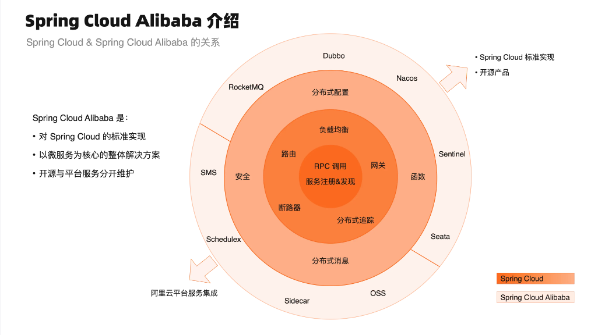

+++
title = '微服务开发简介'
date = 2024-10-26T11:52:38+08:00
draft = false
+++

# 1. 什么是微服务

## 1.1 定义

微服务是一种软件架构风格，它将一个大型的单体应用程序拆分成多个小的、独立的服务。每个服务都可以独立开发、部署和扩展，并且通常通过轻量级的通信机制（如HTTP或消息队列）进行交互。以下是微服务的一些关键特性：

1. **独立部署** ：每个微服务可以独立部署，不需要重新部署整个应用程序。
2. **技术多样性** ：不同的微服务可以使用不同的技术栈，根据需要选择最合适的工具和语言。
3. **松耦合** ：微服务之间通过明确的接口进行通信，减少了服务之间的依赖性。
4. **专注单一职责** ：每个微服务专注于完成特定的业务功能，遵循单一职责原则。
5. **弹性和可扩展性** ：可以根据需求独立扩展某个微服务，提高系统的弹性和可扩展性。

微服务架构的优点包括提高开发效率、增强系统的灵活性和可维护性，但也带来了分布式系统的复杂性，如服务发现、负载均衡、分布式事务和监控等问题。

最好的形容：
一个人的公司，一旦生病，公司随时倒闭 => 单体服务
多个人的公司，一人生命，公司继续运转不影响 => 微服务

## 1.2 使用场景

微服务架构适用于以下场景：

1. **复杂应用程序** ：当应用程序复杂且包含多个模块时，微服务可以将其拆分为更小的服务，便于管理和开发。
2. **快速迭代** ：需要频繁发布新功能或更新的应用程序，微服务允许独立部署，减少发布周期。
3. **团队规模大** ：大型团队可以根据功能模块划分为多个小团队，每个团队负责一个或多个微服务，减少团队间的依赖。
4. **多样化技术栈** ：不同的服务可以使用不同的技术栈，选择最适合的工具和语言来实现特定功能。
5. **高可扩展性** ：需要高可扩展性的应用程序，可以根据需求独立扩展某个微服务，提高系统的弹性。
6. **高可用性要求** ：通过隔离故障，微服务架构可以提高系统的整体可用性，某个服务的故障不会影响整个系统。

这些场景下，微服务架构能够提供更高的灵活性、可维护性和可扩展性。

# 2. 什么是 Spring Cloud

信息来源：[Spring Cloud](https://spring.io/projects/spring-cloud)

> Spring Cloud provides tools for developers to quickly build some of the common patterns in distributed systems (e.g. configuration management, service discovery, circuit breakers, intelligent routing, micro-proxy, control bus, short lived microservices and contract testing). Coordination of distributed systems leads to boiler plate patterns, and using Spring Cloud developers can quickly stand up services and applications that implement those patterns. They will work well in any distributed environment, including the developer’s own laptop, bare metal data centres, and managed platforms such as Cloud Foundry.
> 翻译后就是：Spring Cloud 为开发人员提供了工具，可以快速构建分布式系统中的一些常见模式（例如配置管理、服务发现、断路器、智能路由、微代理、控制总线、短生命周期微服务和契约测试）。分布式系统的协调会导致样板模式，使用 Spring Cloud，开发人员可以快速启动实现这些模式的服务和应用程序。它们在任何分布式环境中都能很好地工作，包括开发人员自己的笔记本电脑、裸机数据中心和托管平台（如 Cloud Foundry）。

这段话主要描述了Spring Cloud为开发者提供了一套工具，这些工具可以帮助他们快速构建分布式系统中的一些常见模式。以下是对这段话的详细解释：

1. **Spring Cloud**: 是一个基于Spring Boot的框架，它为微服务架构提供了一系列的解决方案。
2. **tools for developers**: Spring Cloud提供的工具，旨在帮助开发者。
3. **quickly build some of the common patterns in distributed systems**: 快速构建分布式系统中的常见模式。这些模式是分布式系统中普遍需要解决的问题，Spring Cloud通过提供工具来简化这些问题的解决过程。
4. **e.g.**: 举例说明，后面列举了一些分布式系统中的常见模式。
5. **configuration management**: 配置管理，指的是集中管理应用和服务的配置信息。
6. **service discovery**: 服务发现，允许服务在不知道彼此网络地址的情况下相互发现和通信。
7. **circuit breakers**: 断路器模式，防止系统过载的一种机制，当某个服务失败时，断路器可以防止进一步的请求发送到该服务。
8. **intelligent routing**: 智能路由，根据当前的系统状态和请求特性，智能地将请求路由到最合适的服务实例。
9. **micro-proxy**: 微代理，为微服务提供代理功能，可以进行请求转发、负载均衡等。
10. **control bus**: 控制总线，允许开发者在分布式系统中广播消息，用于配置更新、服务协调等。
11. **short lived microservices**: 短暂生命周期的微服务，指的是那些生命周期短、需要快速启动和停止的服务。
12. **contract testing**: 契约测试，确保服务之间的接口符合预期的约定。
13. **Coordination of distributed systems**: 分布式系统的协调，指的是在多个服务和组件之间进行通信和同步。
14. **boiler plate patterns**: 模板模式，指的是在构建分布式系统时需要重复使用的代码或模式。
15. **stand up services and applications**: 快速搭建服务和应用程序。
16. **work well in any distributed environment**: 在任何分布式环境中都能良好工作，包括开发者的个人笔记本电脑、裸机数据中心和像Cloud Foundry这样的托管平台。

总的来说，这段话强调了Spring Cloud如何通过提供一套工具来简化分布式系统开发中的常见问题，使得开发者能够快速构建、部署和运行分布式应用和服务。

## 3. Spring Cloud Alibaba 介绍

### 3.0 建议学习官网

建议学习官网：[Spring Cloud Alibaba官网_基于Springboot的微服务教程-阿里云](https://sca.aliyun.com/)，尤其要关注版本发布声明，这里有针对不同版本的适配的声明，如 SpringBoot 版本为 2.6.x ，需要使用2021版的相关组件

一旦发生错误，后果不堪设想

### 3.1 什么是Spring Cloud Alibaba

本章主要来源：[Spring Cloud Alibaba 是什么-阿里云Spring Cloud Alibaba官网](https://sca.aliyun.com/docs/2023/overview/what-is-sca/?spm=5176.29160081.0.0.74805c72VPRqIr)

> Spring Cloud Alibaba 致力于提供微服务开发的一站式解决方案。此项目包含开发分布式应用服务的必需组件，方便开发者通过 Spring Cloud 编程模型轻松使用这些组件来开发分布式应用服务。依托 Spring Cloud Alibaba，您只需要添加一些注解和少量配置，就可以将 Spring Cloud 应用接入阿里分布式应用解决方案，通过阿里中间件来迅速搭建分布式应用系统。此外，[Spring Cloud Alibaba 企业版](https://www.aliyun.com/product/aliware/mse?spm=sca-website.topbar.0.0.0)，包括无侵入服务治理(全链路灰度，无损上下线，离群实例摘除等)，企业级 Nacos 注册配置中心和企业级云原生网关等众多产品。

但对于个人学习来讲，非企业版本即可足够使用

本质：是在 Spring Cloud 的基础上，进行了增强，补充了一些额外的能力，根据阿里多年的业务沉淀做了一些定制化的开发

这张图展示了Spring Cloud Alibaba与Spring Cloud的关系，并且详细列出了Spring Cloud Alibaba中的一些核心组件。以下是关于Spring Cloud标准实现和开源产品的详细介绍：

**Spring Cloud 标准实现**

1. **RPC 调用**：远程过程调用（Remote Procedure Call, RPC）是一种通信协议，允许在不同计算机上的程序相互调用对方的功能或服务。
2. **服务注册&发现**：服务注册与发现是微服务架构中的重要组成部分，用于动态地管理和查找可用的服务实例。
3. **负载均衡**：负载均衡是指将网络流量均匀分布到多个服务器上，以提高系统的响应速度和可靠性。

**开源产品**

1. **Nacos**：

   - Nacos是一个易于使用、功能强大的动态服务发现、配置管理和服务治理平台。
   - 它支持服务注册与发现、分布式配置管理以及服务治理等功能。
2. **Dubbo**：

   - Dubbo是一款高性能、轻量级的开源Java RPC框架，它提供了面向接口的远程方法调用方案。
   - Dubbo的主要特点是性能高、易用性好、可扩展性强。
3. **RocketMQ**：

   - RocketMQ是由阿里巴巴开发的一款开源消息中间件，具有高性能、低延迟的特点。
   - 它支持发布/订阅模式的消息传递，适用于大规模分布式系统中的异步通信场景。
4. **Seata**：

   - Seata是一个开源的分布式事务解决方案，旨在提供高性能和简单易用的分布式事务支持。
   - 它通过全局事务协调器来保证分布式环境下的数据一致性。
5. **Sentinel**：

   - Sentinel是一个开源的流量控制库，主要用于保护后端服务免受大流量冲击。
   - 它可以实时监控应用的入口流量，并根据预设规则进行限流、降级等操作。
6. **Sidecar**：

   - Sidecar模式通常用于微服务架构中，指的是为每个服务部署一个单独的进程，该进程负责处理服务之间的通信和其他辅助任务。
   - 这种模式有助于解耦服务间的依赖关系，提高系统的灵活性和可维护性。
7. **OSS (Object Storage Service)**：

   - OSS是阿里云提供的对象存储服务，用于存储和检索任意类型的文件。
   - 它提供了高可用性和持久性的存储能力，适合于各种应用场景，如图片、视频、日志等非结构化数据的存储。
8. **Schedulx**：

   - Schedulx是一个分布式调度平台，用于管理和执行定时任务。
   - 它支持多种触发方式和丰富的任务类型，能够满足企业级应用的需求。
9. **SMS (Short Message Service)**：

   - SMS模块通常指短信服务，用于发送和接收短信息。
   - 在微服务架构中，它可以作为通知机制的一部分，用于用户认证、订单确认等场景。

这些组件共同构成了Spring Cloud Alibaba的核心功能，帮助开发者构建高效、可靠的微服务应用程序。
