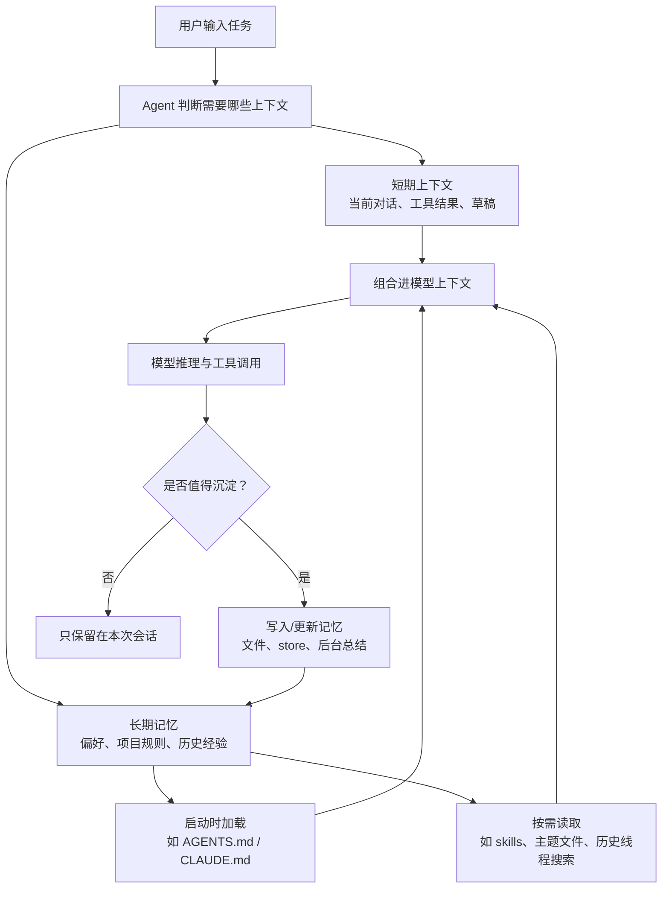
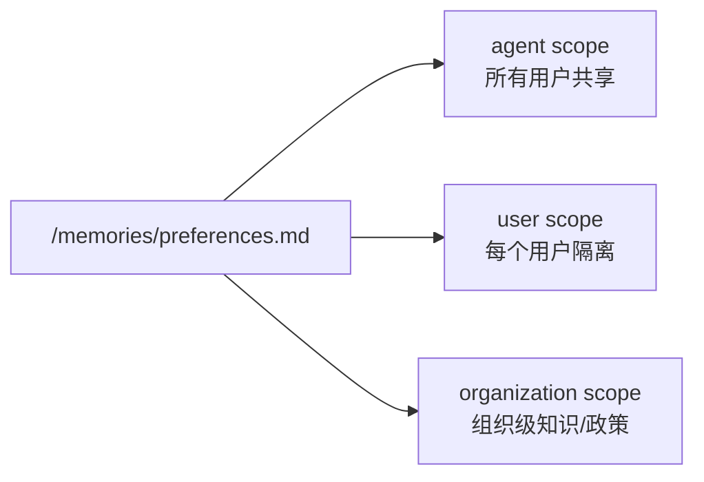
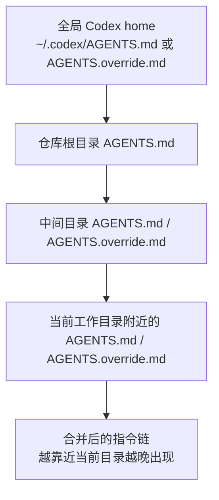
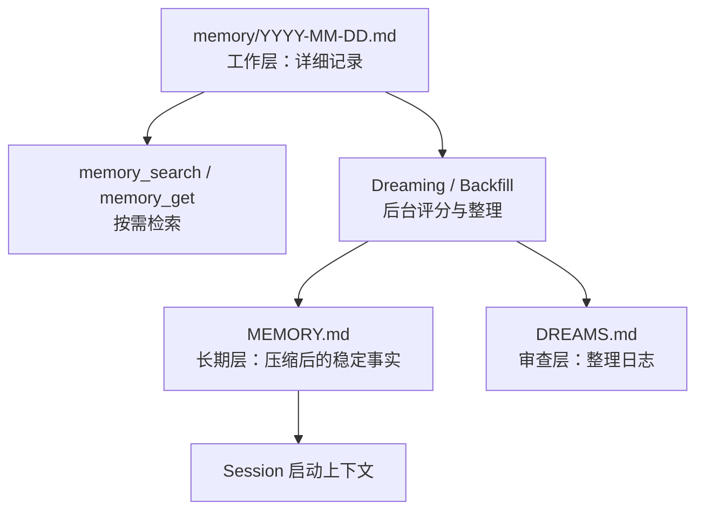

+++
title = "代码编程工具的记忆机制"
description = "系统梳理 LangChain Deep Agents、Claude Code、Codex、OpenClaw 与 Hermes Agent 的记忆设计：它们如何存储、检索、更新上下文，以及工程上如何避免污染、泄露和陈旧。"
date = 2026-07-13T10:00:00+08:00
draft = false
tags = ["Agent", "大模型开发", "上下文工程", "AI 编程工具"]
categories = ["大模型开发"]
+++

这篇文章回答一个核心问题：AI 编程工具的“记忆”到底是什么，它怎么存、怎么读、怎么更新，为什么不能简单理解成“模型真的记住了我”。

## 1. 一句话结论

代码编程工具里的“记忆”通常不是修改模型参数，而是把可复用的信息持久化到外部载体中，例如 Markdown 文件、向量/对象存储、线程检查点、规则文件、技能文件或本地生成的记忆摘要；之后在合适的时机把这些信息重新注入上下文，或按需检索出来辅助模型完成任务。

在工程上，它更像一套“上下文管理系统”：

- 记什么：用户偏好、项目约定、调试经验、架构事实、可复用流程、历史会话。
- 存哪里：文件系统、平台 store、本地用户目录、项目目录、线程 checkpoint。
- 给谁看：某个用户、某个 agent、某个项目、某个组织。
- 什么时候读：启动时注入、路径命中时加载、任务匹配时按需读取、搜索历史线程。
- 什么时候写：对话中立即写、空闲后后台总结、定时 consolidation。
- 谁能写：agent 可写、只读策略、人工审批、应用代码写入。

## 2. 先分清几类记忆

### 2.1 短期记忆和长期记忆

短期记忆是一次会话里的上下文，例如当前聊天记录、临时草稿、工具调用结果、当前任务状态。它让 agent 在同一轮任务中保持连贯。

长期记忆跨会话存在，例如“这个项目使用 pnpm”、“提交前要跑 `cargo test`”、“某个 API 测试依赖本地 Redis”。它让下次打开同一工具时不必重新说明。

### 2.2 四种常见信息类型

| 类型 | 含义 | 编程工具中的例子 |
| --- | --- | --- |
| 语义记忆 | 稳定事实和偏好 | 项目技术栈、用户喜欢中文回答、测试命令 |
| 情节记忆 | 过去发生过的过程 | 上次排查性能问题时的调用链和结论 |
| 程序性记忆 | 做事方法 | “发布前检查清单”“如何跑集成测试” |
| 规则/策略记忆 | 必须遵守的边界 | 不提交密钥、不改生成文件、先跑 lint |

面试里可以这样说：语义记忆回答“是什么”，情节记忆回答“发生过什么”，程序性记忆回答“怎么做”，规则记忆回答“必须怎么做或不能怎么做”。

## 3. 一张图理解记忆系统



关键点：记忆不是“自动全量塞进提示词”。成熟系统会考虑上下文预算，只加载当前任务真正需要的信息。

## 4. LangChain Deep Agents 的记忆设计

LangChain Deep Agents 把长期记忆做成一等能力，核心思想是“文件系统式记忆 + 后端命名空间”。agent 通过文件路径读取和写入 memory，后端决定这些文件实际存放在哪里、谁能访问。

### 4.1 基本流程

Deep Agents 的记忆流程可以概括为三步：

1. 创建 agent 时通过 `memory=` 指定记忆文件路径，也可以通过 `skills=` 指定程序性记忆。
2. agent 在启动时把必要记忆载入系统提示，或在对话中按需读取。
3. agent 学到新信息后，可以通过文件编辑工具更新记忆；也可以在后台集中整理。

Deep Agents 明确区分短期记忆和长期记忆：短期记忆由 agent 状态和 checkpoint 管理，长期记忆通过 store 持久化，能跨线程使用。

### 4.2 作用域：agent、user、organization

Deep Agents 很强调“命名空间”。同一个记忆文件路径，在不同 namespace 下可以代表完全不同的数据。



常见模式：

- Agent-scoped memory：所有用户共享同一份 agent 记忆，适合 agent 自身经验、通用能力积累。
- User-scoped memory：每个用户一份独立记忆，适合个人偏好、历史上下文，避免跨用户泄露。
- Organization-level memory：组织级策略或知识，通常应只读，避免被某个用户通过提示注入污染。

面试重点：多租户系统里默认应该选择 user scope，只有明确需要共享时才使用 agent 或 organization scope。

### 4.3 高级能力

Deep Agents 还提供几种工程上很重要的设计：

- 情节记忆：通过 checkpointed thread 保存过去对话，再提供“搜索历史会话”的工具，让 agent 找回过去解决问题的过程。
- 后台整理：用另一个 consolidation agent 定期读取近期会话，把有价值的信息合并到长期记忆，降低用户请求路径上的延迟。
- 读写权限：共享策略、合规规则、开发者定义的 skills 应该只读；用户偏好、agent 自我改进类内容可以读写。
- 并发冲突：多个线程同时写同一个文件可能出现 last-write-wins，因此共享记忆最好按主题拆文件，或用后台整理串行化。
- 审计：通过 tracing 查看 agent 对记忆文件的写入，方便排查错误沉淀。

### 4.4 LangChain 的设计启发

LangChain 给我们的启发是：记忆不是一个单点功能，而是一套可配置的存储、检索、权限和更新策略。真正难的不是“存下来”，而是“存对、隔离对、读得准、写得安全”。

## 5. Claude Code 的记忆设计

Claude Code 的记忆分两层：显式项目指令和自动记忆。

### 5.1 显式项目指令：CLAUDE.md

`CLAUDE.md` 是 Claude Code 的项目级记忆入口。Claude Code 会从当前工作目录向上遍历目录树，加载沿途的 `CLAUDE.md` 和 `CLAUDE.local.md`。越靠近当前目录的文件越晚进入上下文，因此更贴近当前工作的指令具有更强的局部影响。

典型用途：

- 项目如何安装依赖。
- 修改后跑哪些测试。
- 代码风格和目录约定。
- 不要修改哪些文件。
- 团队协作约束。

`CLAUDE.local.md` 更适合个人本地笔记，不应提交团队共享内容。

### 5.2 `.claude/rules/`：把规则模块化

较大的项目可以把规则拆到 `.claude/rules/` 目录中。规则文件可以无条件加载，也可以通过 frontmatter 的 `paths` 限定到特定文件模式。

例如：

```md
---
paths:
  - "src/api/**/*.ts"
---

# API 开发规则

- 所有 API 端点必须包括输入验证。
- 使用统一错误响应格式。
- 修改 API 时同步更新文档。
```

这类路径限定规则的价值是节省上下文：只有当 Claude 处理匹配路径的文件时，规则才会进入上下文。

### 5.3 自动记忆

Claude Code 还有自动记忆能力：它会在工作过程中判断哪些信息未来有用，然后保存构建命令、调试结论、架构笔记、代码风格偏好和工作流习惯等。

自动记忆的典型结构是：

```text
~/.claude/projects/<project>/memory/
├── MEMORY.md
├── debugging.md
├── api-conventions.md
└── ...
```

其中 `MEMORY.md` 是索引。Claude Code 启动时只加载 `MEMORY.md` 的前一部分，详细主题文件按需读取。这样既保留长期经验，又避免每次会话都塞入过多无关上下文。

### 5.4 `/memory` 命令

Claude Code 的 `/memory` 命令用于查看和编辑当前加载的记忆文件，也可以切换自动记忆。因为这些记忆是 Markdown 文件，所以用户可以审计、修改或删除。

面试重点：Claude Code 同时支持“人写给 agent 的规则”和“agent 自己沉淀的经验”。前者更适合确定性规范，后者更适合反复出现的偏好和经验。

## 6. Codex 的记忆设计

Codex 的相关机制可以分成三类：Memories、`AGENTS.md`、Skills。它们都能帮助 Codex 跨任务保留上下文，但定位不同。

### 6.1 Memories：本地回忆层

Codex 官方手册把 Memories 描述为一个可选能力。开启后，Codex 可以把早期线程中的有用信息转成后续工作可用的本地记忆，例如稳定偏好、重复工作流、技术栈、项目约定和已知坑点。

重要特征：

- 默认关闭，需要在 Codex 设置中开启，或在 `~/.codex/config.toml` 的 `[features]` 中设置。
- 主记忆文件位于 `~/.codex/memories/`。
- Codex 会避开活跃或过短的会话，不一定在线程结束后立刻生成记忆。
- 生成过程会在后台执行，并受速率限制阈值影响。
- Codex 会对生成记忆中的 secrets 做脱敏，但用户仍应在分享 Codex home 目录前检查。
- 在 Codex app 和 TUI 中可以通过 `/memories` 控制当前线程是否使用既有记忆、是否允许当前线程成为未来记忆来源。

面试重点：Codex Memories 是“辅助回忆层”，不是强规则系统。真正必须遵守的团队规则应该放进 `AGENTS.md` 或仓库文档。

### 6.2 AGENTS.md：项目级持久指令

`AGENTS.md` 是 Codex 最重要的显式项目记忆。Codex 在开始工作前读取这些文件，用来建立当前仓库的工作约定。

加载逻辑可以理解为：



典型用途：

- 仓库构建、测试、lint 命令。
- 代码风格和架构约定。
- 审查重点和提交要求。
- 哪些文件不能改。
- 特定子目录的特殊规则。

`AGENTS.override.md` 适合临时覆盖同级 `AGENTS.md`。Codex 也有 `project_doc_max_bytes` 等配置，控制项目指令总大小，默认有上下文预算限制。

### 6.3 Skills：程序性记忆

Codex Skills 是可复用工作流的载体。一个 skill 通常包含 `SKILL.md`、可选脚本、参考材料和资源。它适合封装“完成某类任务的方法”，例如“如何创建插件”“如何处理 GitHub PR 评论”“如何生成并校验文档”。

Skills 的关键是 progressive disclosure：

- Codex 初始只看到 skill 的名称、描述和路径。
- 当用户显式调用或任务描述匹配时，Codex 才读取完整 `SKILL.md`。
- 这样能减少上下文占用，同时保留复杂流程能力。

面试重点：`AGENTS.md` 更像项目规则，Memories 更像本地经验，Skills 更像可复用操作手册。

## 7. OpenClaw 的记忆设计

OpenClaw 是更接近“常驻个人 agent”的设计：它运行一个 Gateway，把聊天平台、工具、sessions、workspace 和多 agent 路由连起来。它的记忆机制非常强调本地文件、可搜索索引和跨会话工作连续性。

### 7.1 三层记忆文件

OpenClaw 官方文档明确说：模型只记得保存到磁盘上的内容，没有隐藏状态。默认 workspace 通常是 `~/.openclaw/workspace`，主要记忆文件包括：

- `MEMORY.md`：长期记忆，保存稳定事实、偏好、决策和简短总结，会在 session 开始时加载。
- `memory/YYYY-MM-DD.md`：日记式工作层，保存当天上下文、观察、会话总结和更详细的材料；今天和昨天的 notes 会在裸 `/new` 或 `/reset` 时自动加载。
- `DREAMS.md`：可选的“梦境”日记，用来记录后台整理和候选长期记忆，便于人类审查。

可以这样理解：



这和 Claude Code 的 `MEMORY.md + 主题文件` 有点像，但 OpenClaw 把日期笔记、搜索索引和后台 promotion 讲得更系统。

### 7.2 搜索：keyword + vector + hybrid

OpenClaw 默认内置 memory engine，使用 per-agent SQLite 数据库存储索引。它支持：

- FTS5 关键词搜索，适合查精确 ID、文件名、错误码。
- embedding 向量搜索，适合语义相近但措辞不同的回忆。
- hybrid search，把关键词和向量召回结合起来。
- CJK trigram tokenization，对中文、日文、韩文更友好。

默认会索引 `MEMORY.md` 和 `memory/*.md`，并切成带 overlap 的 chunks。文件变化会触发 debounce reindex。高级用户可以切到 QMD memory engine，让 OpenClaw 用本地 sidecar 做 BM25、向量搜索、reranking、query expansion，并索引 workspace 外的目录或历史 session transcripts。

### 7.3 Action-sensitive memory

OpenClaw 很强调“会影响未来行动的记忆”必须带边界。比如：

- 谁批准了这个动作。
- 什么时候可以执行。
- 是否有过期条件。
- 是否来自可信来源。
- 未来应该避免什么行为。

这是面试里特别值得讲的一点：记忆不只是事实，还可能改变 agent 的行动策略。如果记忆里只写“可以改 API”，却不写“等迁移方案批准后才能改”，agent 未来就可能越权行动。

OpenClaw 文档也强调：memory 可以保存 approval context，但不负责强制执行策略；硬控制应该放在 approval settings、sandboxing 和 scheduled tasks 里。

### 7.4 Dreaming：后台整理和提升

OpenClaw 的 Dreaming 是可选的后台 consolidation。它会收集短期 recall 信号，对候选记忆打分，只有满足分数、召回频率、查询多样性等条件的内容才会提升到 `MEMORY.md`。整理过程会写入 `DREAMS.md` 供人类审查。

这类似 LangChain 的 background consolidation，但 OpenClaw 更产品化：它有 dreaming sweep、grounded backfill、short-term dreaming store、deep promotion 等机制。

### 7.5 多 agent 隔离

OpenClaw 的 multi-agent routing 里，每个 agent 都有自己的 workspace、`agentDir` 和 session store。例如 session 历史存储在 `~/.openclaw/agents/<agentId>/sessions` 下。多 agent 场景下，一个 agent 可以通过配置搜索另一个 agent 的 QMD transcript collection，但默认应该保持隔离。

面试重点：OpenClaw 的记忆机制是“本地文件 + SQLite/sidecar 搜索索引 + 后台 promotion + 多 agent 隔离”。它非常适合常驻个人助手，但也因为长期运行、工具权限高、记忆可影响未来行动，所以安全风险更明显。

## 8. Hermes Agent 的记忆设计

Hermes Agent 是 Nous Research 做的“会成长的 agent”。它的记忆机制比较有代表性：核心长期记忆很小、非常克制；但它会结合 session search、外部 memory providers 和自动生成 skills，形成一个闭环学习系统。

### 8.1 两个核心记忆文件

Hermes 的内置 persistent memory 由两个文件组成，存放在 `~/.hermes/memories/`：

- `MEMORY.md`：agent 的个人笔记，保存环境事实、项目约定、学到的经验，默认约 2,200 字符。
- `USER.md`：用户画像，保存用户偏好、沟通风格、期待和工作习惯，默认约 1,375 字符。

这两个文件会在每个 session 开始时作为 frozen snapshot 注入 system prompt。所谓 frozen snapshot，是指启动时读一次；session 过程中即使 agent 写入了新记忆，也要到下一次 session 才会进入 system prompt。这样做的目的之一是保留 LLM prefix cache，提高性能和稳定性。

### 8.2 memory tool：add / replace / remove

Hermes 通过 `memory` tool 管理记忆，支持：

- `add`：新增记忆。
- `replace`：用 substring 匹配替换已有记忆。
- `remove`：用 substring 匹配删除过时记忆。

它没有单独的 `read` action，因为当前记忆在 session 开始时已经注入上下文；工具响应会展示 live state。

Hermes 的一个强约束是容量上限：如果写入会超过限制，工具会返回错误，而不是静默截断。agent 必须在同一轮里合并、替换或删除旧条目后再写入。这是一种很工程化的“逼迫记忆保持紧凑”的设计。

### 8.3 Session Search：长期历史不等于核心记忆

Hermes 把“关键事实”和“历史会话”分开。核心记忆只有约 1,300 tokens，适合一直放进 prompt；历史会话则全部存入 SQLite `~/.hermes/state.db`，通过 FTS5 的 `session_search` 工具按需检索。

对比：

- memory：快、每次都在上下文里、有固定 token 成本、容量很小。
- session search：容量几乎无限、按需搜索、适合查“上周我们是不是讨论过 X”。

这点非常适合面试回答：好的记忆系统不把“所有历史”都塞进长期记忆，而是把高价值事实提升到核心记忆，把细节留在可检索历史中。

### 8.4 后台 review 和写入审批

Hermes 在 turn 之后会运行 background self-improvement review。这个 review 可能会：

- 保存新的 memory。
- 更新用户画像。
- 创建或修改 skill。
- 把重复纠正和稳定流程沉淀成更紧凑的条目。

默认情况下 Hermes 可以自由写记忆；如果设置 `memory.write_approval: true`，前台写入、消息平台写入、脚本写入和后台 review 写入都会先 staged，用户可以通过 `/memory pending`、`/memory approve`、`/memory reject` 审批。

这比单纯“agent 自动记住”更稳：它把自动学习和人类同意分开。

### 8.5 Skills：程序性记忆的自我进化

Hermes 官方文档把 skills 称为 on-demand knowledge documents。它们存在 `~/.hermes/skills/`，遵循 progressive disclosure：先列出 name、description、category，只有需要时才加载完整内容。

Hermes 的特别之处在于它会从经验中创建和改进 skills：

- `/learn` 可以把本地目录、在线文档、刚刚走过的流程或手写说明转成 `SKILL.md`。
- background review 可以在任务后更新 skill。
- 可以设置 `skills.write_approval: true`，让 skill 创建、编辑、删除都先进入审批队列。

因此，Hermes 的“记忆”不只保存事实，还会把“怎么做某件事”沉淀成可复用技能。这就是它所谓 self-improving 的核心。

### 8.6 安全扫描和外部 memory providers

Hermes 会在接受记忆前扫描 prompt injection、credential exfiltration、SSH backdoor、不可见 Unicode 等风险模式。它还支持 Honcho、Mem0、Hindsight、Supermemory 等外部 memory providers，用于知识图谱、语义搜索、自动事实提取和跨会话用户建模。

面试重点：Hermes 的记忆设计是“小核心记忆 + 大历史搜索 + 后台自我评审 + 程序性技能沉淀”。它比 OpenClaw 更强调 self-improvement 和容量约束。

## 9. 五个工具对比

| 维度 | LangChain Deep Agents | Claude Code | Codex | OpenClaw | Hermes Agent |
| --- | --- | --- | --- | --- | --- |
| 核心定位 | 开发者可编排的 agent memory 框架 | 编程助手的项目指令与自动记忆 | 编程 agent 的本地记忆、项目指令和技能 | 常驻个人 agent / multi-channel gateway | 会自我改进的常驻 agent |
| 显式规则 | memory files、skills、backend route | `CLAUDE.md`、`.claude/rules/` | `AGENTS.md`、config、skills | `MEMORY.md`、daily notes、workspace files、`SOUL.md` | `MEMORY.md`、`USER.md`、context files、skills |
| 自动沉淀 | 对话中写入或后台 consolidation | 自动记忆，可用 `/memory` 管理 | Memories 可选开启，后台生成 | automatic memory flush、dreaming、grounded backfill | background review 自动写 memory / skill |
| 存储形态 | 文件路径抽象 + store/backend | 本地 Markdown 文件 | `~/.codex/memories/` 与项目指令文件 | workspace Markdown + per-agent SQLite/QMD index | `~/.hermes/memories/` + `~/.hermes/state.db` + skills |
| 作用域 | user、agent、organization namespace | 用户、项目、本地、托管策略 | 用户本地、项目目录、线程级控制 | per-agent workspace、agentDir、session store | profile / user / session / skill store |
| 启动加载 | memory 文件可进 system prompt | `CLAUDE.md`、`MEMORY.md` 索引 | Memories / `AGENTS.md` / skills list | `MEMORY.md` 和近期 daily notes | `MEMORY.md` / `USER.md` frozen snapshot |
| 按需检索 | skills、历史线程搜索 | 主题文件、路径规则、skills | skills、嵌套 `AGENTS.md`、工具上下文 | `memory_search`、`memory_get`、QMD、session history | `session_search`、external providers、skills |
| 程序性记忆 | skills | skills | Skills | skills / ClawHub | skills，可自动创建和自改进 |
| 容量策略 | 由后端和 prompt 策略控制 | `MEMORY.md` 索引部分加载，主题文件按需 | memory 生成受设置和后台机制约束 | bootstrap budget，详细内容放 daily notes | 严格字符上限，超限必须合并/删除 |
| 安全重点 | 租户隔离、只读共享、并发写审计 | 指令冲突、上下文过大、规则不等于强制 | Memories 不是强规则，敏感信息需审计 | action-sensitive memory、sandbox、approval、multi-agent 隔离 | write approval、skill approval、注入/泄露扫描 |

## 10. 共同点和差异点

### 10.1 共同点

这五类系统有几个共同趋势：

- 都把记忆外部化：不是改模型参数，而是写文件、store、SQLite、索引或技能目录。
- 都在做分层：短期会话状态、长期核心事实、历史记录、程序性技能分开管理。
- 都在控制上下文预算：启动只加载高价值摘要，详细材料按需读取或搜索。
- 都开始重视程序性记忆：skills / workflow / rules 不只是“知道什么”，而是“知道怎么做”。
- 都需要权限和审计：记忆会影响未来行为，不能把它当普通聊天记录。

### 10.2 关键差异

差异主要体现在四个问题上：

| 问题 | 不同答案 |
| --- | --- |
| 谁来写记忆？ | Claude、Codex、OpenClaw、Hermes 都有自动沉淀；LangChain 更像框架，写入策略由开发者定义。 |
| 记忆有多大？ | Hermes 最克制，有明确字符上限；OpenClaw 更偏文件库 + 搜索；LangChain 取决于 backend；Claude/Codex 介于两者之间。 |
| 记忆如何变成行动？ | OpenClaw 和 Hermes 都更接近常驻个人 agent，记忆、定时任务、工具权限会共同影响未来行动；Claude/Codex 更偏编程会话辅助。 |
| 风险在哪里？ | 多租户框架怕跨用户泄露；代码助手怕错误规则污染；常驻 agent 怕 sleeper channel，即不可信输入先沉淀成记忆/skill/cron，之后在另一个场景触发。 |

### 10.3 面试里的总结句

可以这样总结：

> LangChain 更像记忆基础设施，Claude Code 和 Codex 更像编程项目上下文系统，OpenClaw 更像本地常驻个人助手的文件化记忆系统，Hermes 更像带自我评审和技能进化的学习型 agent。它们共同点都是外部化记忆、按需注入、控制上下文；差异在于作用域、自动化程度、容量策略、技能自进化和安全边界。

## 11. 设计一个可靠记忆系统的原则

### 11.1 先定义记忆边界

不要把所有历史都叫记忆。建议先分层：

- 会话态：当前任务必须使用，但任务结束可以丢弃。
- 用户态：用户稳定偏好，例如语言、解释风格、常用栈。
- 项目态：仓库命令、架构、约定，最好随代码一起版本化。
- 组织态：安全、合规、发布政策，通常只读。
- 技能态：可复用流程，用按需加载避免污染上下文。

### 11.2 默认隔离，谨慎共享

记忆一旦跨用户共享，就有提示注入和数据泄露风险。默认应该按用户隔离；组织级内容用只读方式注入；共享写入要经过人工审核或应用层校验。

### 11.3 控制上下文预算

记忆越多不一定越好。过多上下文会稀释关键指令，增加成本和延迟。成熟设计通常采用：

- 索引文件启动加载。
- 主题文件按需读取。
- skills 只在匹配任务时展开。
- 历史会话通过搜索召回，而不是全量注入。

### 11.4 记忆要可审计

记忆会影响 agent 行为，所以必须可检查：

- 使用纯文本或结构化格式保存关键记忆。
- 记录是谁写入、何时写入、依据是什么。
- 对共享记忆提供审批。
- 支持删除、禁用和回滚。

### 11.5 区分“行为指导”和“强制控制”

`AGENTS.md`、`CLAUDE.md`、记忆文件本质上是给模型看的上下文，不是安全边界。必须强制执行的内容应该落到：

- 权限系统。
- 沙箱。
- hook。
- CI。
- 代码审查规则。
- 服务端策略。

## 12. 常见坑

### 12.1 把记忆当数据库

记忆适合保存对 agent 有用的上下文，不适合作为业务事实的唯一来源。业务事实应从数据库、API 或权威文档读取。

### 12.2 把记忆当系统提示

许多工具里的记忆是作为上下文或用户级指令注入，不一定具备系统提示的优先级。面试时要强调：记忆能塑造行为，但不能保证强制遵守。

### 12.3 存入秘密

不要把 API key、token、客户隐私写入记忆。即使工具提供脱敏，也应假设记忆文件可能被审计、同步或误分享。

### 12.4 记忆冲突

例如全局说“用 npm”，项目说“用 pnpm”，子目录说“用 yarn”。解决方式是设定明确优先级：越局部越优先，越权威越优先，冲突时让 agent 提醒用户。

### 12.5 记忆陈旧

项目迁移后，旧记忆可能误导 agent。应定期清理，或在记忆中记录时间、来源、适用范围。

## 13. 面试回答模板

### 13.1 30 秒回答

AI 编程工具的记忆不是模型权重里的永久记忆，而是外部化的上下文管理。它会把项目规则、用户偏好、历史调试经验、可复用流程等保存到文件、store 或线程 checkpoint 中，下次任务开始时按作用域和相关性重新注入或检索。好的记忆系统要解决四件事：存什么、给谁看、什么时候读写、如何防止污染和泄露。

### 13.2 2 分钟回答

我会把编程 agent 的记忆分为短期和长期。短期记忆是一次会话里的消息、工具调用结果和临时状态；长期记忆是跨会话复用的信息，比如用户偏好、项目约定、历史问题结论和标准工作流。

不同工具实现不同。LangChain Deep Agents 把 memory 做成文件系统式抽象，通过 backend namespace 实现 user、agent、organization 作用域，还支持后台 consolidation 和只读共享策略。Claude Code 用 `CLAUDE.md`、`.claude/rules/` 和自动记忆结合，前者是人写的项目规则，后者是工具自己沉淀的 Markdown 笔记。Codex 则有 Memories、`AGENTS.md` 和 Skills。OpenClaw 更像常驻个人 agent，用 `MEMORY.md`、daily notes、SQLite/QMD 搜索和 Dreaming 做长期回忆。Hermes Agent 更强调自我改进，用小容量 `MEMORY.md/USER.md`、session search、background review 和自动 skills 沉淀经验。

工程上最重要的是隔离和审计。用户级记忆不能泄露到其他用户；组织级策略最好只读；敏感信息不应进入记忆；必须强制的规则不能只靠提示词，而要用权限、hook、CI 或服务端策略保证。

### 13.3 深挖问题与答法

**问：记忆和 RAG 有什么区别？**

RAG 通常是从外部知识库检索事实；记忆更偏 agent 自身长期上下文，包括偏好、历史经验、项目规则和工作流。两者可以结合：记忆决定“我该怎么工作”，RAG 提供“我该参考哪些知识”。

**问：为什么不能把所有记忆都放进 prompt？**

因为上下文窗口有限，噪声会稀释关键指令，也会增加成本和延迟。更好的做法是索引启动加载、详细内容按需读取、历史会话搜索召回。

**问：共享记忆有什么风险？**

主要是跨用户泄露和提示注入。一个用户如果能写入所有人都会读取的记忆，就可能污染 agent 行为。所以共享记忆应只读，或由应用代码/人工审核写入。

**问：如果记忆和用户当前指令冲突怎么办？**

当前明确指令通常优先于历史偏好；项目/组织规则优先于个人偏好；安全和权限策略优先于模型上下文。agent 应说明冲突并选择更高优先级的来源。

**问：如何评估记忆系统是否有效？**

看四类指标：重复说明减少了多少、任务成功率是否提升、错误记忆导致的回归有多少、记忆读写是否可审计和可删除。

## 14. 实践模板：项目指令应该怎么写

### 14.1 AGENTS.md / CLAUDE.md 示例

```md
# Project Instructions

## Setup

- Use `pnpm install` to install dependencies.
- Start the dev server with `pnpm dev`.

## Verification

- Run `pnpm lint` after editing TypeScript files.
- Run `pnpm test` after changing business logic.

## Code Style

- Prefer existing patterns over new abstractions.
- Keep public utility behavior documented in `docs/`.

## Safety

- Do not commit secrets or generated credentials.
- Ask before adding a new production dependency.
```

### 14.2 自动记忆适合记录什么

适合：

- “这个项目的 e2e 测试依赖本地 Redis。”
- “用户偏好中文总结、英文代码注释。”
- “支付服务的测试命令是 `make test-payments`。”
- “上次 flaky test 的根因是系统时区依赖。”

不适合：

- 密钥、token、密码。
- 客户隐私数据。
- 一次性临时指令。
- 已经过时的迁移方案。
- 应由 CI 或权限系统强制的安全规则。

## 15. 最后记忆一张表

| 面试关键词 | 应该说出的核心点 |
| --- | --- |
| 本质 | 外部化、可检索、可注入的上下文管理 |
| 不是什么 | 不是模型参数更新，不是业务数据库，不是安全边界 |
| 信息类型 | 语义、情节、程序性、规则/策略 |
| 作用域 | 用户、项目、agent、组织 |
| 读取策略 | 启动加载、按需读取、搜索召回 |
| 写入策略 | 对话中写、后台整理、人工审核 |
| 风险 | 泄露、注入、陈旧、冲突、上下文污染 |
| 工程解法 | 隔离、只读共享、审计、最小加载、明确优先级 |

## 16. 参考来源

- LangChain Deep Agents Memory：<https://docs.langchain.com/oss/python/deepagents/memory>
- Claude Code Memory 中文文档：<https://code.claude.com/docs/zh-CN/memory>
- Codex 参考文章（用户指定）：<https://zhuanlan.zhihu.com/p/2028586838806344324>
- OpenAI Codex 官方手册补充核验：<https://developers.openai.com/codex/codex-manual.md>
- OpenClaw Memory Overview：<https://docs.openclaw.ai/concepts/memory>
- OpenClaw Builtin Memory Engine：<https://docs.openclaw.ai/concepts/memory-builtin>
- OpenClaw Multi-agent Routing：<https://docs.openclaw.ai/concepts/multi-agent>
- Hermes Agent Persistent Memory：<https://hermes-agent.nousresearch.com/docs/user-guide/features/memory>
- Hermes Agent Skills System：<https://hermes-agent.nousresearch.com/docs/user-guide/features/skills>
- Hermes Agent 官方主页与 GitHub：<https://hermes-agent.nousresearch.com/>、<https://github.com/NousResearch/hermes-agent>
